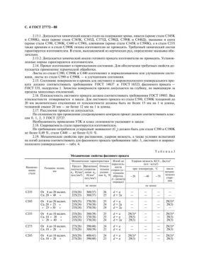
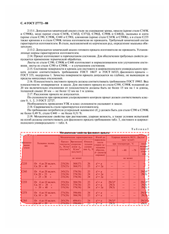
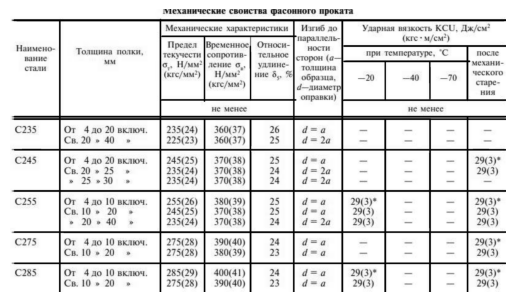
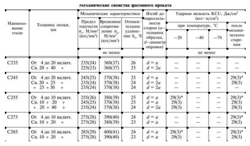
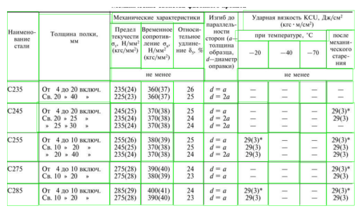
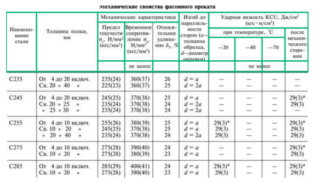
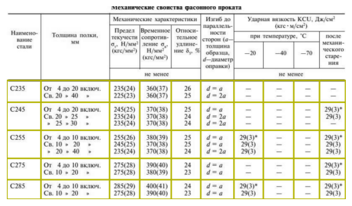

## Table Detection and Recognition

This project aims to develop an end-to-end solution for table detection and recognition in documents and images. The primary goal is to build a system that can automatically detect tables within documents, extract the tabular data and recognize the contents of the tables using optical character recognition (OCR) techniques.

## Technologies and Methods

The project utilizes a combination of computer vision, deep learning and natural language processing techniques to achieve table detection and recognition. The following technologies and methods are employed:

1. **OpenCV**: OpenCV is used for image preprocessing and contour detection to identify potential table regions within documents.

2. **Mask R-CNN**: The Mask R-CNN architecture is employed for table segmentation and pixel-wise object detection. This deep learning model allows us to precisely delineate table boundaries.

3. **EasyOCR**: The EasyOCR engine is used for text recognition within the detected tables. It provides support for multiple languages and is well-suited for recognizing text in various formats.

## Project Architecture

The project follows a modular architecture to enable easy extensibility and maintainability. The major components include:

1. **Table Detection**: This module focuses on using OpenCV and Mask R-CNN to detect table regions within documents and images.

2. **Table Recognition**: The table recognition module employs EasyOCR to extract text from the detected tables.

3. **Data Post-Processing**: The extracted tabular data to organize and present it in a structured format, such as yaml or json.

4. **User web-interface**: A simple user web-interface is provided for interacting with the system, allowing users to upload documents and download detected tables along with recognized text. But TableExtraction.ipynb is recommend for more customizable code interaction.

# Step by Step Detection
To help with debugging and understanding the model, there is notebook ([TableExtraction.ipynb](TableExtraction/TableExtraction.ipynb)), which provide many visualizations and allow you to step through the model to check the output at each point, change settings and see possible code errors that occur. Here are some examples:

## 1. File selection
First, select the PDF file which you want to extract tabular information from. Specify its address in the code:
```python
extractor.extract('PUT/YOUR/FILE/ADDRESS/HERE.pdf')
```


## 2. Finding a table on a page
Run the code. You will see a visualization of the table data recognition processes, the first of which will be finding the table on the page.



## 3. Line detection
Further, in the area where the table was found at the previous step, lines are searched that bound the cells of the table.



## 4.Table node detection
After finding the lines, you need to understand how the cells are located relative to each other. With the help of sequential processing, potential nodes are found, repetitions are removed, sorting occurs.



## 5.Cells detection
Once we've established the table's structure, the next step is to detect individual cells within it.
 - **Mask R-CNN**: We can use Mask R-CNN to directly recognize and segment individual cells within the table.
 - **Empirically**: Alternatively, we can rely on empirical rules based on the table's structure and layout to infer cell positions.



## 6. Separating headers and records
Next, the cells are divided into those that store the names of the columns and data-storing cells.
 - **Mask R-CNN**: We can employ Mask R-CNN to recognize header and data cells.
 - **Empirically**: Based on prior knowledge about table formatting, we can use heuristics and logic to distinguish header cells from data cells.




## 7. Result
As a result of the algorithm, a file with the yaml extension will appear in the results folder, in which the structured data of each of the pages of the document will be stored

## Installation

Before using this code, make sure you have the following prerequisites installed:

- Microsoft Visual C++ 14.0: You can download it from [here](https://visualstudio.microsoft.com/downloads/).

- ImageMagick: Install ImageMagick by following the guidelines provided [here](https://docs.wand-py.org/en/latest/guide/install.html#install-imagemagick_on-windows).

- Poppler: Ensure you have Poppler version 23.07.0 or newer installed.You can download it from [here](https://github.com/oschwartz10612/poppler-windows/releases/). You can either place it in **C:\Program Files** or modify the path in the **preprocessing.py** file as needed.

Now you can get started, follow these steps:

1. Clone this repository
   ```bash
   git clone https://github.com/DikovAlexandr/TableExtraction
   ```
2. Create a virtual environment (recommended) to isolate project dependencies
   ```bash
   # On Unix/Linux
   python3 -m venv table_extraction_venv

   # On Windows
   python -m venv table_extraction_venv
   ```
   ```bash
   # On Unix/Linux
   source table_extraction_venv/bin/activate

   # On Windows
   table_extraction_venv\Scripts\activate
   ```
3. Install the required dependencies from the requirements.txt file and setup.py:
   ```bash
   pip3 install -r requirements.txt
   ```
4. Downloading Pre-trained Model Weights:

   Before running the code, you have the option to download pre-trained model weights. You can choose between two versions: full precision (original) weights and quantized weights for memory efficiency.

   - Full Precision Weights:

   ```bach
   wget https://www.dropbox.com/scl/fi/fn5re0opdtnbxnb0gr2hr/mask_rcnn_tablebank_cfg.h5 -O detect_table_plot.pth
   ```

   ```bach
   wget https://www.dropbox.com/scl/fi/fn5re0opdtnbxnb0gr2hr/mask_rcnn_tablebank_cfg.h5 -O best_cell_detection.pth
   ```

   - Quantized Weights:

   ```bach
   wget https://www.dropbox.com/scl/fi/fn5re0opdtnbxnb0gr2hr/mask_rcnn_tablebank_cfg.h5 -O detect_table_plot_quantized_model.pth
   ```

   ```bach
   wget https://www.dropbox.com/scl/fi/fn5re0opdtnbxnb0gr2hr/mask_rcnn_tablebank_cfg.h5 -O best_cell_detection_quantized_model.pth
   ```

### Contributing

If you have any ideas, bug reports, or feature requests, feel free to open an issue or submit a pull request on the project's repository.

### License
The project is open-source and licensed under the Apache-2.0 license. You can find the details in the `LICENSE` file.
